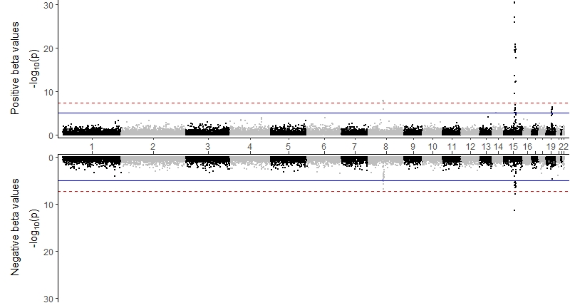

# MiamiPlot
 R function to create a ggplot2 based miami plot

## Installation
Install directly from github using devtools
```
library(devtools)
install_github("juliedwhite/miamiplot", build_vignettes = TRUE)
```
Load the package each time you use it:
```
library(miamiplot)
```

## Usage
See the vignette for more examples:
```
vignette("miamiplot")
```

Take a look at the built-in data:
```
head(gwas_results)
```

Basic miami plot using built-in data, with positive beta values in the upper
plot and negative beta values in the lower plot.
```
ggmiami(data = gwas_results[which(gwas_results$study == "A"),], 
        split_by = "beta", split_at = 0, p = "pval", 
        upper_ylab = "Positive beta values",
        lower_ylab = "Negative beta values")
```



If you'd like to construct your own code "from scratch" (maybe you want to 
change the appearance and position of the axes or something else), there is
a tutorial using the background code from the package in 
vignette("scratch_miamiplots").
